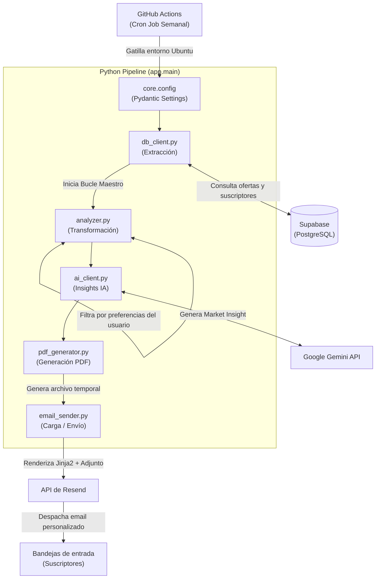
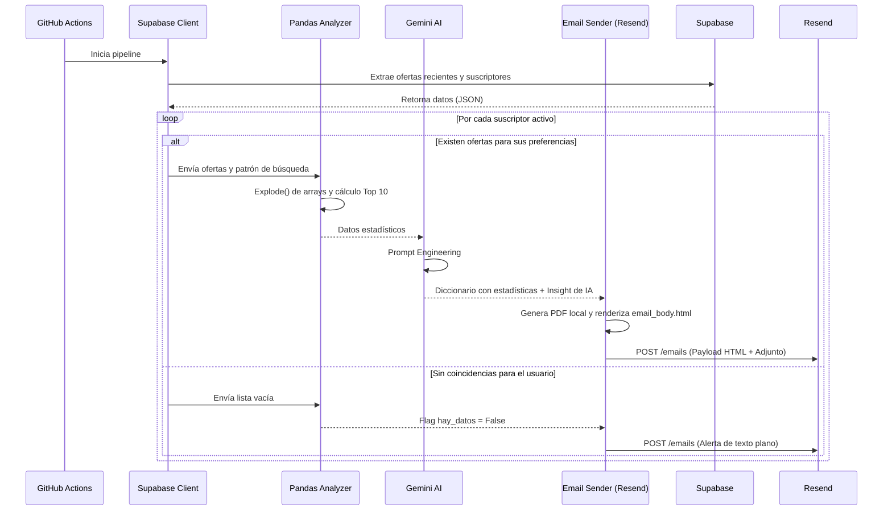

# Tech Job Reporter

Pipeline ETL (Extract, Transform, Load) automatizado y serverless construido con Python. Extrae datos de un scraper laboral en Supabase, genera métricas de mercado utilizando Pandas, redacta insights inteligentes mediante Inteligencia Artificial y envía reportes HTML dinámicos con PDFs adjuntos a una lista de suscriptores mediante la API de Resend.

---

## Descripción general

Este proyecto funciona como el motor analítico de un ecosistema de scraping de ofertas laborales, operando bajo una arquitectura multi-usuario (SaaS). Ejecutándose en piloto automático a través de GitHub Actions, el sistema consulta la base de datos en busca de nuevas ofertas ingresadas en los últimos 7 días. Luego, recupera una lista de suscriptores activos, procesa las tecnologías para identificar tendencias del mercado (Top 10), filtra las ofertas ideales según las preferencias individuales de cada usuario, utiliza Google Gemini para redactar un resumen ejecutivo y, finalmente, despacha un reporte personalizado con un PDF adjunto directo a la bandeja de entrada de cada suscriptor.

---

## Arquitectura Serverless

Al no requerir un servidor encendido 24/7, el proyecto adopta un enfoque de ejecución efímera. La infraestructura nace, procesa los datos en lote (Batch Processing) para múltiples usuarios y se destruye en cada ciclo.



---

## Flujo de ejecución (Ciclo de vida del reporte)

El sistema está diseñado con tolerancia a fallos y flujos alternativos. Procesa a los usuarios de manera aislada; si el envío falla para un suscriptor, el error se captura y el pipeline continúa con el siguiente sin detenerse.



---

## Stack tecnológico

| Componente | Tecnología |
|---|---|
| Lenguaje base | Python 3.12 |
| Gestor de dependencias | uv |
| Extracción (Base de Datos) | Supabase Python Client |
| Transformación (Análisis) | Pandas |
| Inteligencia Artificial | Google Generative AI (Gemini 2.5) |
| Generación de vistas | Jinja2 |
| Integración de Email | Resend SDK |
| Validación de entorno | Pydantic Settings |
| Orquestación y CI/CD | GitHub Actions |

---

## Resiliencia y Seguridad

**Gestión de variables y secretos**
- Integración estricta con Pydantic Settings. Si falta una variable de entorno crítica (como una API Key), el script aplica el principio de *Fail Fast* y detiene la ejecución inmediatamente.
- Las credenciales en producción están aisladas en los *Repository Secrets* de GitHub.

**Aislamiento de Errores (Fault Tolerance)**
- Bucle maestro protegido: En el procesamiento por lotes (Batch Processing), si ocurre un error crítico al generar o enviar el reporte a un usuario específico (ej. rebote de API), la excepción se captura, se registra en los logs y el iterador avanza al siguiente usuario, garantizando que el resto reciba su correo.

**Degradación elegante (Graceful Degradation)**
- Manejo de listas vacías: Si la consulta a la base de datos no arroja resultados, las transformaciones de Pandas y las llamadas a la IA se omiten de forma segura.
- Plan de contingencia en notificaciones: El sistema distingue entre un reporte exitoso (HTML completo + PDF) y una alerta de inactividad (texto plano).

**Logging y Trazabilidad**
- Implementación del módulo nativo `logging` en todas las capas.
- Registro de la cantidad exacta de ofertas procesadas, usuarios activos e IDs de transacciones devueltas por Resend, facilitando el debugging en la consola de GitHub Actions.

---

## Estructura del proyecto

El código sigue los principios de Responsabilidad Única (SRP), separando la infraestructura de la lógica de negocio.

```text
tech-job-reporter/
├── .github/
│   └── workflows/
│       └── reporter.yml      # Definición del Cron Job y pasos de ejecución
├── app/
│   ├── core/
│   │   └── config.py         # Validación Pydantic de variables de entorno
│   ├── services/
│   │   ├── analyzer.py       # Cálculos y transformaciones con Pandas
│   │   ├── ai_client.py      # Conexión con modelo LLM (Gemini)
│   │   ├── pdf_generator.py  # Generación de reportes adjuntos
│   │   ├── db_client.py      # Conexión aislada a Supabase
│   │   └── email_sender.py   # Renderizado Jinja2 e integración con Resend
│   ├── templates/
│   │   └── email_body.html   # Estructura visual del reporte
│   └── main.py               # Patrón Fachada: Bucle iterador del pipeline
├── pyproject.toml            # Declaración de dependencias (uv)
└── uv.lock                   # Árbol de dependencias determinista
```

---

## Instalación local y desarrollo

### Requisitos previos
- [uv](https://docs.astral.sh/uv/) instalado en el sistema.
- Python 3.11 o superior.

### 1. Clonar el repositorio

```bash
git clone [https://github.com/tu-usuario/tech-job-reporter.git](https://github.com/tu-usuario/tech-job-reporter.git)
cd tech-job-reporter
```

### 2. Sincronizar el entorno

La herramienta `uv` creará el entorno virtual y descargará las dependencias bloqueadas en milisegundos.

```bash
uv sync
```

### 3. Configurar variables de entorno

Crea un archivo `.env` en la raíz del proyecto basándote en la siguiente estructura. No utilices comillas en los valores.

```env
SUPABASE_URL=[https://tu-proyecto.supabase.co](https://tu-proyecto.supabase.co)
SUPABASE_KEY=tu_anon_key
RESEND_API_KEY=re_tu_api_key_aqui
GEMINI_API_KEY=AIzaSy_tu_api_key_aqui
EMAIL_SENDER=onboarding@resend.dev
```

### 4. Ejecutar el pipeline

Asegúrate de tener al menos un registro en la tabla `suscriptores` de tu base de datos y prueba el flujo completo:

```bash
uv run python -m app.main
```

Revisa tu terminal para seguir el rastro de logs y confirma la recepción del reporte en tu bandeja de entrada.

---

## Variables de entorno requeridas en Producción

Para que el GitHub Action se ejecute correctamente, los siguientes secretos deben ser configurados en `Settings > Secrets and variables > Actions`:

| Secreto | Descripción |
|---|---|
| `SUPABASE_URL` | Endpoint REST proporcionado por Supabase. |
| `SUPABASE_KEY` | Clave anónima (`anon_key`) con permisos de lectura. |
| `RESEND_API_KEY` | Token de acceso de la API de Resend. |
| `GEMINI_API_KEY` | Token de acceso a la API de Google Generative Language. |
| `EMAIL_SENDER` | Dirección del remitente validado (ej. `reportes@tudominio.com`). |
