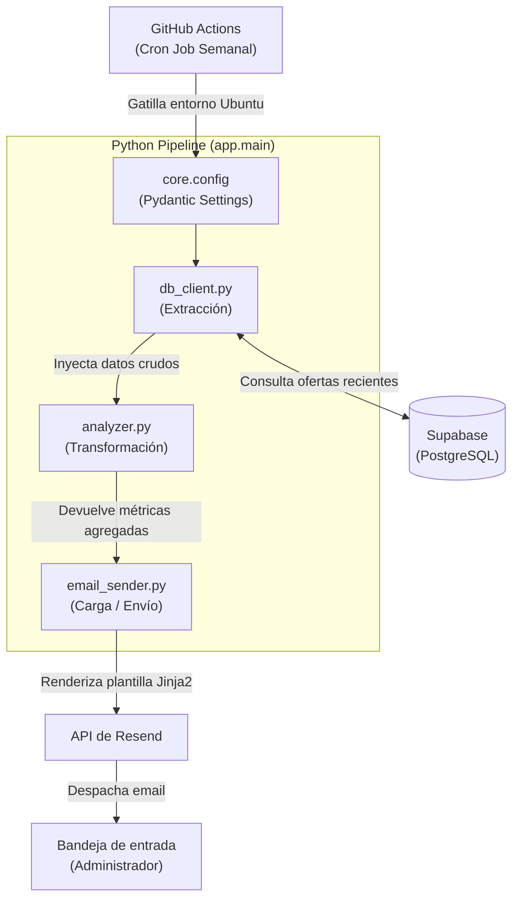
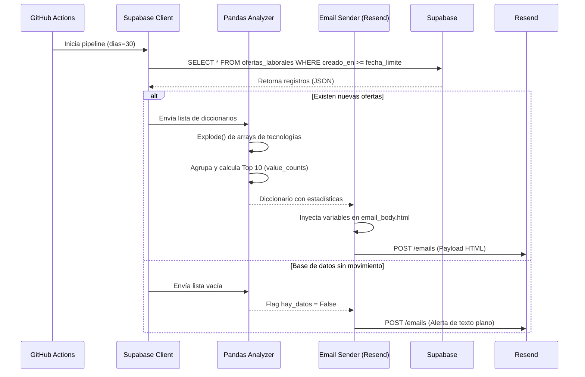

# Tech Job Reporter

Pipeline ETL (Extract, Transform, Load) automatizado y serverless construido con Python. Extrae datos de un scraper laboral en Supabase, genera métricas de mercado utilizando Pandas y envía un reporte HTML dinámico semanal mediante la API de Resend.

---

## Descripción general

Este proyecto funciona como el motor analítico de un ecosistema de scraping de ofertas laborales. Ejecutándose en piloto automático a través de GitHub Actions, el sistema consulta la base de datos en busca de nuevas ofertas ingresadas en los últimos 30 días. Luego, procesa y normaliza los arrays de tecnologías requeridas para identificar tendencias del mercado (Top 10), y finalmente inyecta estos datos en una plantilla Jinja2 para despachar un reporte visual directamente a la bandeja de entrada del administrador.

---

## Arquitectura Serverless

Al no requerir un servidor encendido 24/7, el proyecto adopta un enfoque de ejecución efímera. La infraestructura nace, procesa los datos y se destruye en cada ciclo.



---

## Flujo de ejecución (Ciclo de vida del reporte)

El sistema está diseñado con tolerancia a fallos y flujos alternativos. Si el scraper no recolectó datos nuevos durante la semana, el pipeline lo detecta y evita enviar reportes vacíos, optando por una notificación de texto plano.



---

## Stack tecnológico

| Componente | Tecnología |
|---|---|
| Lenguaje base | Python 3.12 |
| Gestor de dependencias | uv |
| Extracción (Base de Datos) | Supabase Python Client |
| Transformación (Análisis) | Pandas |
| Generación de vistas | Jinja2 |
| Integración de Email | Resend SDK |
| Validación de entorno | Pydantic Settings |
| Orquestación y CI/CD | GitHub Actions |

---

## Resiliencia y Seguridad

**Gestión de variables y secretos**
- Integración estricta con Pydantic Settings. Si falta una variable de entorno crítica (como una API Key), el script aplica el principio de *Fail Fast* y detiene la ejecución inmediatamente antes de realizar peticiones en vano.
- Las credenciales en producción están aisladas en los *Repository Secrets* de GitHub.

**Degradación elegante (Graceful Degradation)**
- Manejo de listas vacías: Si la consulta a la base de datos no arroja resultados, las transformaciones de Pandas se omiten de forma segura, evitando excepciones del tipo `KeyError` o `IndexError`.
- Plan de contingencia en notificaciones: El sistema distingue entre un reporte exitoso (HTML completo) y una alerta de inactividad (texto plano), manteniendo informado al administrador sobre la salud del flujo de datos.

**Logging y Trazabilidad**
- Implementación del módulo nativo `logging` en todas las capas.
- Registro de la cantidad exacta de ofertas procesadas, umbrales de tiempo utilizados y el ID de transacción devuelto por Resend, facilitando el debugging desde la consola de GitHub Actions.

---

## Estructura del proyecto

El código sigue los principios de Responsabilidad Única (SRP), separando la infraestructura de la lógica de negocio.

```text
tech-job-reporter/
├── .github/
│   └── workflows/
│       └── reporter.yml      # Definición del Cron Job y pasos de ejecución
├── app/
│   ├── core/
│   │   └── config.py         # Validación Pydantic de variables de entorno
│   ├── services/
│   │   ├── analyzer.py       # Cálculos y transformaciones con Pandas
│   │   ├── db_client.py      # Conexión aislada a Supabase
│   │   └── email_sender.py   # Renderizado Jinja2 e integración con Resend
│   ├── templates/
│   │   └── email_body.html   # Estructura visual del reporte
│   └── main.py               # Patrón Fachada: Orquestador del pipeline ETL
├── pyproject.toml            # Declaración de dependencias (uv)
└── uv.lock                   # Árbol de dependencias determinista
```

---

## Instalación local y desarrollo

### Requisitos previos
- [uv](https://docs.astral.sh/uv/) instalado en el sistema.
- Python 3.11 o superior.

### 1. Clonar el repositorio

```bash
git clone [https://github.com/tu-usuario/tech-job-reporter.git](https://github.com/tu-usuario/tech-job-reporter.git)
cd tech-job-reporter
```

### 2. Sincronizar el entorno

La herramienta `uv` creará el entorno virtual y descargará las dependencias bloqueadas en milisegundos.

```bash
uv sync
```

### 3. Configurar variables de entorno

Crea un archivo `.env` en la raíz del proyecto basándote en la siguiente estructura. No utilices comillas en los valores.

```env
SUPABASE_URL=[https://tu-proyecto.supabase.co](https://tu-proyecto.supabase.co)
SUPABASE_KEY=tu_anon_key
RESEND_API_KEY=re_tu_api_key_aqui
EMAIL_SENDER=onboarding@resend.dev
EMAIL_RECIPIENT=tu_correo_registrado@gmail.com
```

### 4. Ejecutar el pipeline

Para probar el flujo completo localmente de forma segura:

```bash
uv run python -m app.main
```

Revisa tu terminal para seguir el rastro de logs y confirma la recepción del reporte en tu bandeja de entrada.

---

## Variables de entorno requeridas en Producción

Para que el GitHub Action se ejecute correctamente, los siguientes secretos deben ser configurados en `Settings > Secrets and variables > Actions`:

| Secreto | Descripción |
|---|---|
| `SUPABASE_URL` | Endpoint REST proporcionado por Supabase. |
| `SUPABASE_KEY` | Clave anónima (`anon_key`) con permisos de lectura. |
| `RESEND_API_KEY` | Token de acceso de la API de Resend. |
| `EMAIL_SENDER` | Dirección del remitente (ej. `onboarding@resend.dev`). |
| `EMAIL_RECIPIENT` | Dirección del administrador que recibirá los reportes. |
